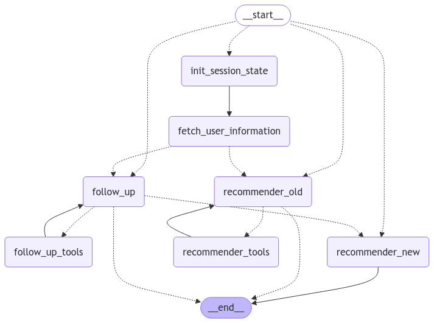
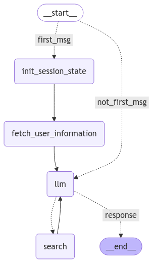

# Seez CRS (Conversational Recommendation System)

Agent-based conversational recommendation system that implements both Single-Agent and Multi-Agent approaches for movie recommendations. 

**Notes:** 
- If using VsCode, please use the command `ctrl + shift + v` to format the markdown.
- I'm using OpenAI GPT-4o model for this project.

## Features

- **Dual Architecture**: Switch seamlessly between Single-Agent and Multi-Agent approaches
- **Async API**: Built on FastAPI for high-performance async operations
- **Web Interface**: Interactive Streamlit frontend for easy system interaction
- **Session Management**: Persistent conversation history and user state tracking
- **Adaptive Responses**: Contextual recommendations based on user history and preferences
- **Error Resilience**: Robust error handling and automatic retry mechanisms

## Architecture

### Multi-Agent Approach
The Multi-Agent system orchestrates specialized agents for different aspects of the recommendation process.
- The performance of the multi-agent approach is better than the single-agent approach.
- It gives recommendations for new/old users based on user id as we can not map username/userid.
- We can do better with agentic approach, but due to time constraints, this is not bad!




### Single-Agent Approach
A simplified approach using a unified agent for end-to-end recommendation process.
- The performance of the single-agent approach is not as good as the multi-agent approach, but it is still good.
- It gives recommendations for new/old also.



## Quick Start

### Prerequisites

- Python 3.10+
- OpenAI API key

### Installation

1. **Set Up Python Environment**
```bash
# Create virtual environment
python3.10 -m venv .venv

# Activate virtual environment
source .venv/bin/activate  # Linux/macOS
# or
.venv\Scripts\activate  # Windows
```

2. **Install Dependencies**
```bash
pip install --upgrade pip
pip install -r requirements.txt
```

3. **Configure Environment**

Create a `.env` file in the project root or add the env variable via:
```bash
export OPENAI_API_KEY=your_api_key_here
```

For Streamlit UI:
```bash
mkdir -p ~/.streamlit
echo 'OPENAI_API_KEY="your_api_key_here"' > ~/.streamlit/secrets.toml
```

## Usage

### Starting the API Server

```bash
# Start the FastAPI server
python run_api.py
```

### Running the Web Interface

```bash
# Launch Streamlit app
streamlit run run_streamlit_app.py
```

### API Endpoints

- `POST /chat`: Submit a chat message
  ```json
  {
    "message": "I'm looking for a sports car under $50,000",
    "user_id": "user123",
    "graph_type": "multi"
  }
  ```

- `GET /session/{user_id}`: Retrieve session information